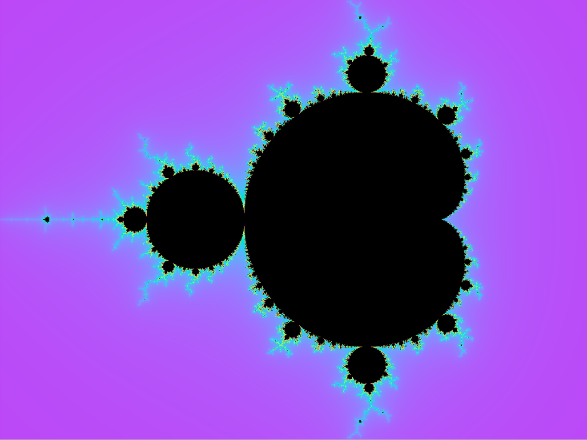
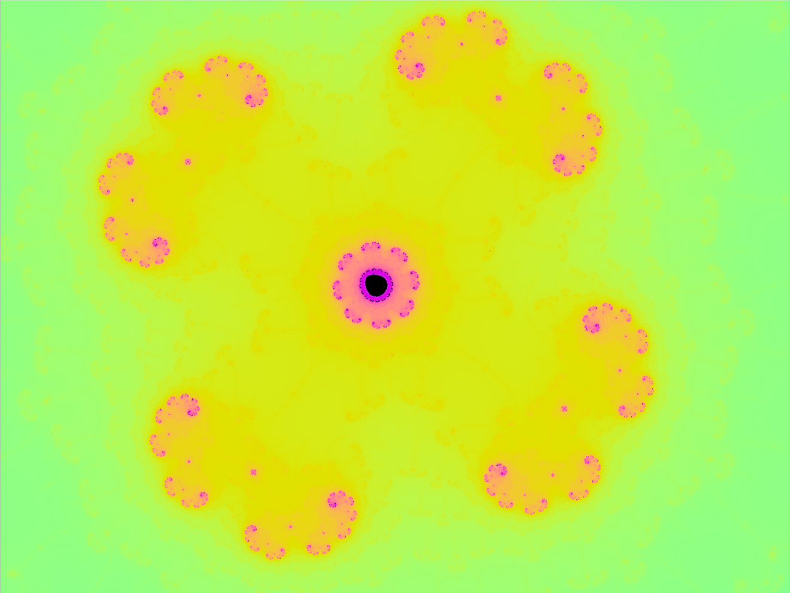

# vulkan-fractals
Clone of my [vulkan-test](https://github.com/kwmbe/vulkan-test) repo for trying to visualise fractals with vulkan.

## Running the application
First generate the shader by going into the shaders directory and running `compile.sh`:
```
cd shaders
./compile.sh
```

If successful, go back to the root folder with `cd ..`.

Next, go into the build directory and compile the application with:
```
cd build
cmake ..
cmake --build .
```
Now you can execute the application from the root folder with `build/Fractals`

## Controls
Click and drag to pan around.
Scroll for zooming in and out.

## Gallery



